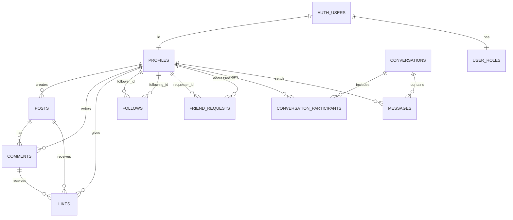

# SocialCore

SocialCore is a multi-page social networking web app where users can register, create posts, interact with content, build connections, and chat.

## Project Description

SocialCore provides a classic social platform flow:

- Public users (guests) can view the landing page and access login/register pages.
- Authenticated users can:
  - manage profile data,
  - create/edit/delete their own posts,
  - like posts and comments,
  - write comments and threaded replies,
  - follow users,
  - send/accept/decline friend requests,
  - use direct messaging.
- Admin users can:
  - manage platform users through admin tools,
  - moderate comments,
  - use protected Supabase Edge Functions for user administration.

## Architecture

### Front-end

- **Type:** Multi-Page Application (MPA)
- **Build tool:** Vite (`vite.config.js` with multiple page entry points)
- **UI:** Bootstrap 5 + Bootstrap Icons + custom CSS
- **Client code:** Vanilla JavaScript ES modules in `js/`
- **Pages:** Separate HTML files in `pages/`, each wired to its own module

### Back-end / BaaS

- **Platform:** Supabase
- **Auth:** Supabase Auth (`auth.users`)
- **Database:** Supabase Postgres with Row Level Security (RLS)
- **Server-side logic:**
  - SQL functions/RPC (e.g. unread counts, direct conversation creation)
  - Triggers for counters, timestamps, and friendship-follow syncing
  - Supabase Edge Functions for admin user operations (`create-user`, `list-users`, `edit-user`, `delete-user`)

### Data Access Pattern

- Front-end modules call helper methods from `js/database.js`.
- `js/supabase.js` initializes the Supabase client using Vite env vars.
- Security is enforced in Postgres (RLS policies + role checks), not only in UI.

## Database Schema Design

The schema is centered around profiles, content, social graph, moderation roles, and messaging.

### Main Tables

- **Core social:** `profiles`, `posts`, `comments`, `likes`, `follows`
- **Friendship:** `friend_requests`
- **Messaging:** `conversations`, `conversation_participants`, `messages`
- **Access control:** `user_roles`

### ER Diagram (Main Relationships)



### Notes

- `likes` supports post-like and comment-like behavior (polymorphic via `post_id` or `comment_id`).
- `comments` supports threaded replies through `parent_comment_id`.
- `friend_requests` with status `accepted` triggers mutual follow records.
- `conversations` supports direct messaging and participant-based access.
- Most content tables use UUID primary keys, timestamps, constraints, indexes, and RLS.

## Local Development Setup Guide

### Prerequisites

- Node.js 18+
- npm
- Supabase project (cloud)
- Optional: Supabase CLI for migration workflow

### 1) Install dependencies

```bash
npm install
```

### 2) Configure environment variables

Create `.env` in project root:

```env
VITE_SUPABASE_URL=https://your-project-id.supabase.co
VITE_SUPABASE_ANON_KEY=your-anon-key
```

### 3) Apply database migrations

**Recommended (CLI):**

```bash
npx supabase login
npx supabase link --project-ref your-project-ref
npx supabase db push
```

Migrations are available in both:

- `supabase/migrations/` (CLI-first workflow)
- `database/migrations/` (manual SQL workflow reference)

### 4) Run the app locally

```bash
npm run dev
```

Open `http://localhost:3000`.

### 5) Useful scripts

```bash
npm run build
npm run preview
```

## Key Folders and Files

| Path | Purpose |
|---|---|
| `index.html` | Landing page entry point (public home) |
| `pages/` | App pages (login, register, feed, profile, friends, messages, admin, etc.) |
| `js/` | Page modules + shared client logic |
| `js/main.js` | Shared UI utilities (toasts, helpers, common behavior) |
| `js/database.js` | Main data access layer (posts, comments, likes, follows, friends, messaging) |
| `js/supabase.js` | Supabase client initialization from env vars |
| `css/` | Stylesheets (global and per-page styling) |
| `assets/` | Static assets (images, video, icons) |
| `database/migrations/` | SQL migration scripts (reference/manual execution path) |
| `database/schema-diagram.md` | ASCII schema overview |
| `supabase/migrations/` | Supabase CLI migration history |
| `supabase/functions/` | Edge Functions for admin user management |
| `vite.config.js` | Vite config + multi-page build inputs |
| `SUPABASE_SETUP.md` | Detailed Supabase setup instructions |
| `QUICK_START.md` | Short setup/testing flow |

## Technology Summary

- **Frontend:** HTML5, CSS3, Vanilla JavaScript (ES modules), Bootstrap 5
- **Build tooling:** Vite
- **Backend services:** Supabase Auth, Postgres, RLS, Edge Functions
- **Database language:** SQL (migrations, policies, RPC functions, triggers)
